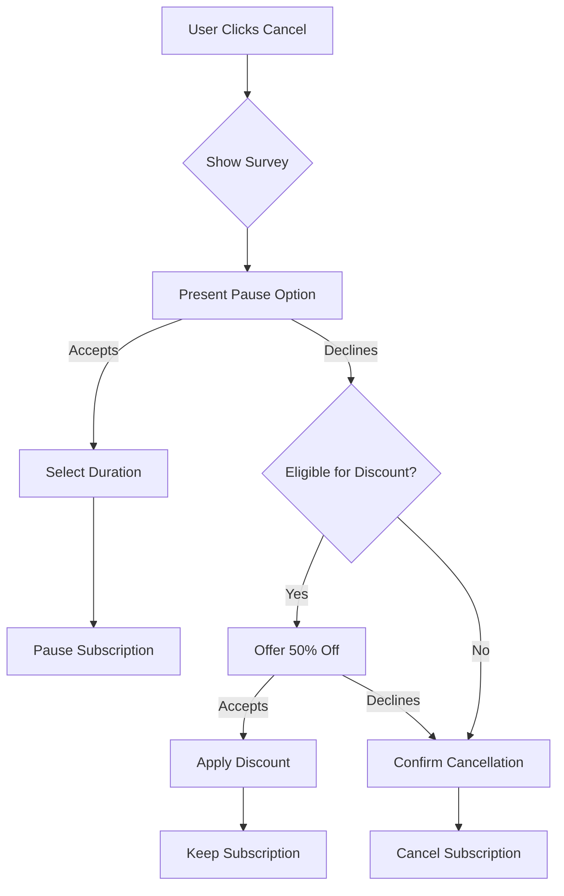

# Subscription Retention & Pause Feature Plan

## Overview

Implement a retention flow when users attempt to cancel their subscription, offering:

1. **Pause Options**: 2 weeks, 1 month, or 2 months
2. **Discount Offer**: 50% off next month if they decline pause
3. **Safeguards**: Prevent abuse of discount system

## Database Schema Changes

### 1. Add to `profiles` table:

```sql
-- Subscription pause tracking
ALTER TABLE profiles ADD COLUMN subscription_paused_until TIMESTAMP WITH TIME ZONE;
ALTER TABLE profiles ADD COLUMN pause_count INTEGER DEFAULT 0;
ALTER TABLE profiles ADD COLUMN last_pause_date TIMESTAMP WITH TIME ZONE;

-- Discount tracking
ALTER TABLE profiles ADD COLUMN discount_used_count INTEGER DEFAULT 0;
ALTER TABLE profiles ADD COLUMN last_discount_date TIMESTAMP WITH TIME ZONE;
ALTER TABLE profiles ADD COLUMN next_eligible_discount_date TIMESTAMP WITH TIME ZONE;
```

### 2. Create `subscription_events` table:

```sql
CREATE TABLE subscription_events (
  id UUID DEFAULT gen_random_uuid() PRIMARY KEY,
  user_id UUID REFERENCES profiles(id) ON DELETE CASCADE,
  event_type VARCHAR(50) NOT NULL, -- 'pause', 'resume', 'discount_offered', 'discount_used', 'cancelled'
  event_data JSONB DEFAULT '{}',
  created_at TIMESTAMP WITH TIME ZONE DEFAULT NOW()
);
```

## Implementation Steps

### Phase 1: UI Components

#### 1. Create Cancellation Flow Modal

```typescript
// src/components/subscription/CancellationFlow.tsx
interface CancellationFlowProps {
  subscription: any;
  onClose: () => void;
  onComplete: () => void;
}

// Flow states:
// 1. Initial: "Why are you leaving?" survey
// 2. Pause Offer: "Take a break instead?"
// 3. Discount Offer: "How about 50% off?"
// 4. Final Confirmation: "Are you sure?"
```

#### 2. Pause Options Component

```typescript
// src/components/subscription/PauseOptions.tsx
interface PauseOption {
  duration: '2_weeks' | '1_month' | '2_months';
  label: string;
  description: string;
  resumeDate: Date;
}
```

### Phase 2: API Endpoints

#### 1. Check Eligibility

```typescript
// /api/subscription/check-retention-eligibility
// Returns:
// - canPause: boolean (max 2 pauses per year)
// - canUseDiscount: boolean (max 1 every 6 months)
// - pauseHistory: Array<PauseEvent>
// - discountHistory: Array<DiscountEvent>
```

#### 2. Pause Subscription

```typescript
// /api/subscription/pause
// Input: { duration: '2_weeks' | '1_month' | '2_months' }
// Actions:
// - Pause subscription in Stripe
// - Update billing anchor
// - Log event
// - Send confirmation email
```

#### 3. Apply Retention Discount

```typescript
// /api/subscription/apply-retention-discount
// Actions:
// - Create 50% off coupon (one-time use)
// - Apply to subscription
// - Update eligibility dates
// - Log event
```

### Phase 3: Stripe Integration

#### 1. Pause Implementation

```typescript
// Using Stripe's pause_collection feature
await stripe.subscriptions.update(subscriptionId, {
  pause_collection: {
    behavior: 'void',
    resumes_at: resumeTimestamp,
  },
});
```

#### 2. Discount Implementation

```typescript
// Create one-time 50% coupon
const coupon = await stripe.coupons.create({
  percent_off: 50,
  duration: 'once',
  max_redemptions: 1,
  metadata: {
    type: 'retention_offer',
    user_id: userId,
  },
});
```

### Phase 4: Business Rules & Safeguards

#### Pause Rules:

1. **Frequency Limit**: Max 2 pauses per rolling 12-month period
2. **Duration Limit**: Total pause time cannot exceed 3 months per year
3. **Timing**: Cannot pause within 7 days of resume date
4. **Credits**: Keep existing credits during pause

#### Discount Rules:

1. **Frequency Limit**: Max 1 discount every 6 months
2. **New User Block**: No discount in first 2 months
3. **History Check**: Track all discount usage
4. **One-Time Use**: Coupon expires after 30 days if unused

### Phase 5: Email Notifications

1. **Pause Confirmation**
   - Pause duration
   - Resume date
   - What happens to credits

2. **Resume Reminder**
   - 3 days before resume
   - Offer to extend pause (if eligible)

3. **Discount Applied**
   - Confirmation of 50% off
   - Next billing amount
   - When discount expires

## User Flow



## Testing Checklist

- [ ] Pause limits enforced (2 per year)
- [ ] Discount limits enforced (1 per 6 months)
- [ ] Billing dates updated correctly
- [ ] Credits preserved during pause
- [ ] Resume happens automatically
- [ ] Stripe webhooks handle pause/resume
- [ ] Emails sent at right times
- [ ] UI shows correct status

## Webhook Handlers Needed

1. `customer.subscription.paused`
2. `customer.subscription.resumed`
3. `customer.discount.created`
4. `customer.discount.deleted`

## Revenue Impact Tracking

Track these metrics:

- Cancellation rate before/after
- Pause-to-resume conversion rate
- Discount-to-retention rate
- Average customer lifetime value
- Revenue per pause vs cancellation
